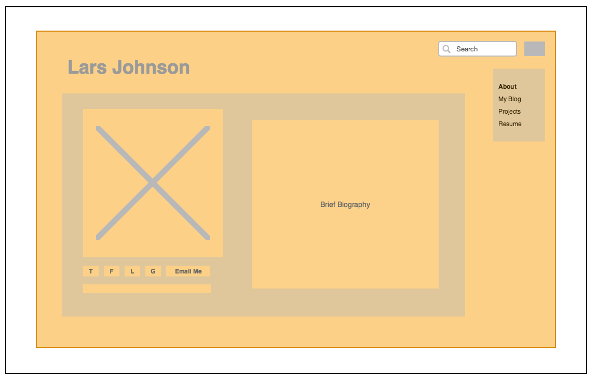
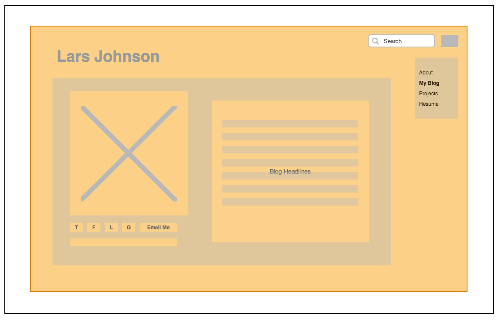

## Initial Wireframes for: larsjx.github.io

## What is a wireframe?

A wireframe is similar to an architectural blueprint and prototyping tool that can be helpful in mapping out high level elements of a website's design and user interface (UI). Some wireframes are whimsical and others are a bit more refined, but one thing they all have in common is that they are intentionally simple representations. This helps make wireframes easy to modify and update while ensuring they are never confused with anything close to the final product.

## What are the benefits of wireframing?

Wireframes are a good starting point for the creation of almost any website or web application because they provide everyone involved with a simple tool for visualizing design themes and key UI elements. They are also very simple to modify and update as needed to address new ideas and changing requirements.

## Did you enjoy wireframing your site?

I found the process of wireframing my site to be both enjoyable and frustrating. I enjoyed creating something new with the knowledge that it may eventually help potential collaborators and employers find and learn more about me. It was also a bit frustrating because I don't have a design background and I found it difficult to come up with any fresh ideas.

## Did you revise your wireframe or stick with your first idea?

I started by sketching out my wireframes and I made two big changes before I finalized them in Gliffy. First I decided to move all of my "about me" content into the index, and then I switched to a vertical navigation bar in the upper right hand corner.

## What questions did you ask during this challenge? What resources did you find to help you answer them?

I spent a lot of time asking myself how I wanted the site to look, so at first I looked at other websites for inspiration. After sketching my wireframes, I wanted to recreate them electronically so I looked at a couple of different options (e.g., balsamiq) before deciding to use Gliffy.

## Which parts of the challenge did you enjoy and which parts did you find tedious?

As mentioned above, I enjoyed the creative element and knowing that this website may one day be used in a meaningful way. I wouldn't say I found anything particularly tedious.