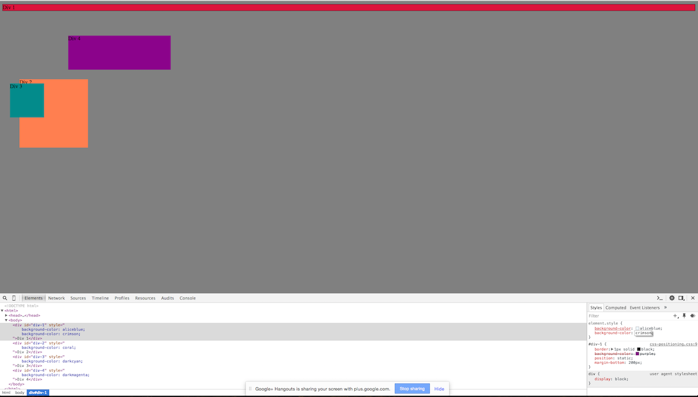
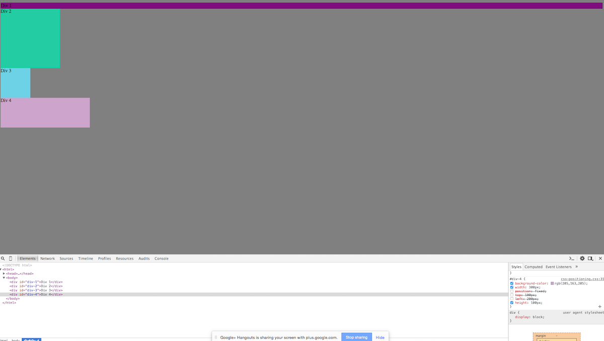
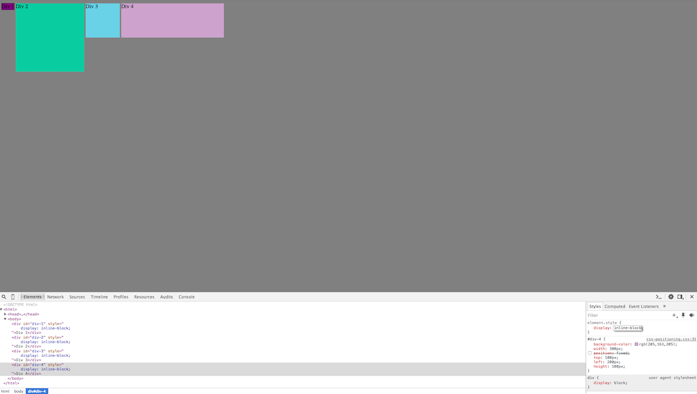
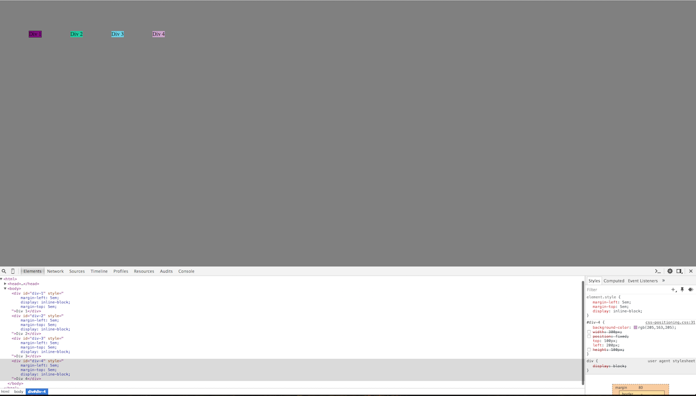
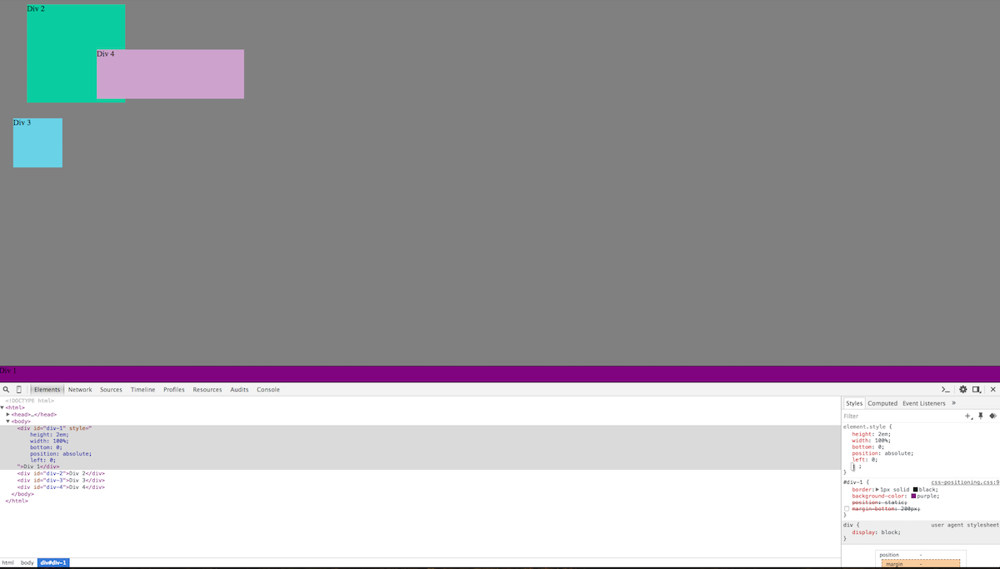
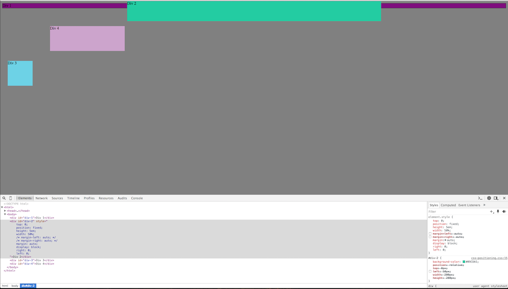
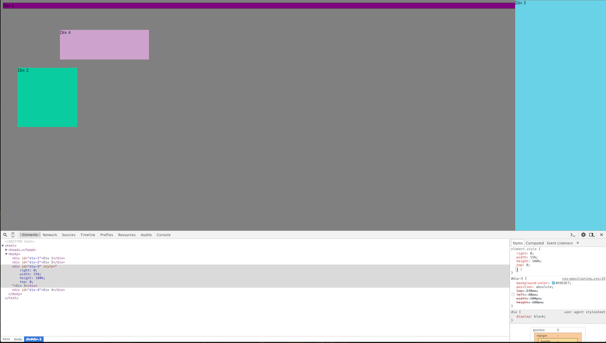
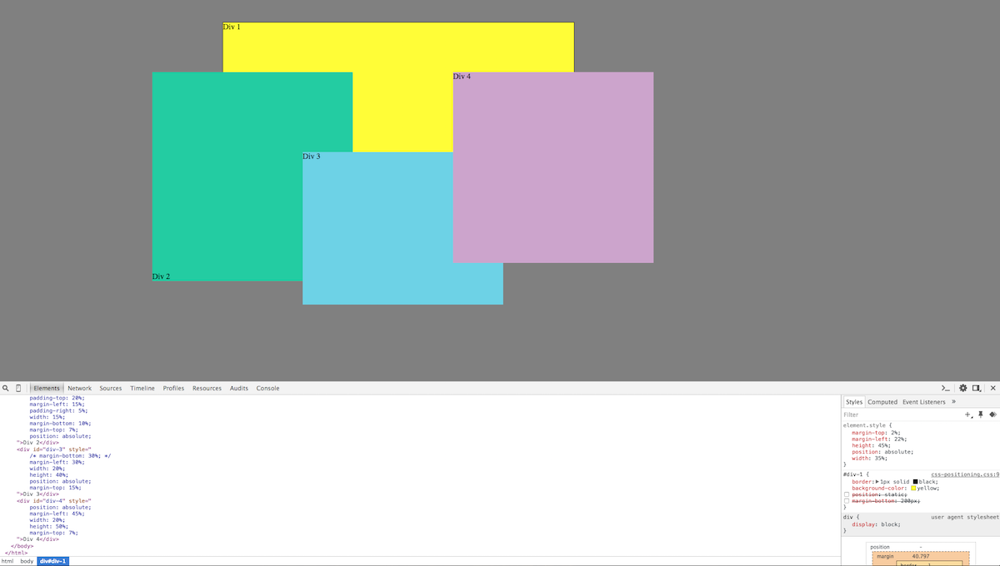

# 3.4 Chrome DevTools : Reflection

## How can you use Chrome's DevTools inspector to help you format or position elements?

We positioned our DevTools at the bottom of our screen and used the DOM tree on the left to identify and select different elements (nodes) that we wanted to work with. In this case we were formatting and positioning 4 different divs. After selecting a particular div to work on, we used the style pane on the right to enable/disable and edit CSS properties such as; position, margin, padding, top, left, background-color, etc. to format and position the divs.

## How can you resize elements on the DOM using CSS?

We resized elements on the DOM by assigning the value of related CSS properties such as; height, width, margin, padding, border-radius, etc. CSS enables fine-grained control over sizing by allowing values to be assigned in pixels, em size, and percentages. Whenever possible, we try to use em size and percentages instead of pixels because these values scale with different screen sizes and resolutions.

## What are the differences between Absolute, Fixed, Static, and Relative positioning? Which did you find easiest to use? Which was most difficult?

The default for all page elements is Static positioning which means the elements simply flow onto the page as they normally would. Absolute and relative positioning are a bit more confusing because (a) Absolute positioning actually means a specific position relative to the next non-static parent element, and (b) an item with Relative positioning is technically positioned "relative to itself." Finally, using Fixed positioning allows us to place an element relative to the browser window or viewport which means it will not move as the user scrolls vertically or horizontally.

Fixed and Absolute positioning were easier for me to use than Relative positioning which was definitely more difficult. Having said that I still find all 3 of these positioning methods to be a bit non-intuitive (at least at this point). In other words, I cannot yet translate a wireframe with multiple elements into a properly arranged web page either completely in my head or even with pencil and paper without experimenting on my CSS and in the browser. This is further complicated when I try to accommodate multiple resolutions/window sizes. Even so, I really enjoy the challenge and look forward to getting more comfortable with lots of practice.

## What are the differences between Margin, Border, and Padding?

Margin refers to the transparent space surrounding an element's Border, and Border refers to the addressable space between the margin and an element's padding. Finally, padding is the transparent space between an element's border and it's content.

## What was your impression of this challenge overall? (love, hate, and why?)

This was a fun challenge. I'm new to Chrome DevTools and loved using them to learn about and experiment with the different ways DOM elements can be laid out and manipulated using CSS.

## Screenshots

## 1. Colors

## 2. Column

## 3. Row

## 4. Equidistant

## 5. Squares

## 6. Footer

## 7. Header

## 8. Sidebar

## 9. Creative Expression

